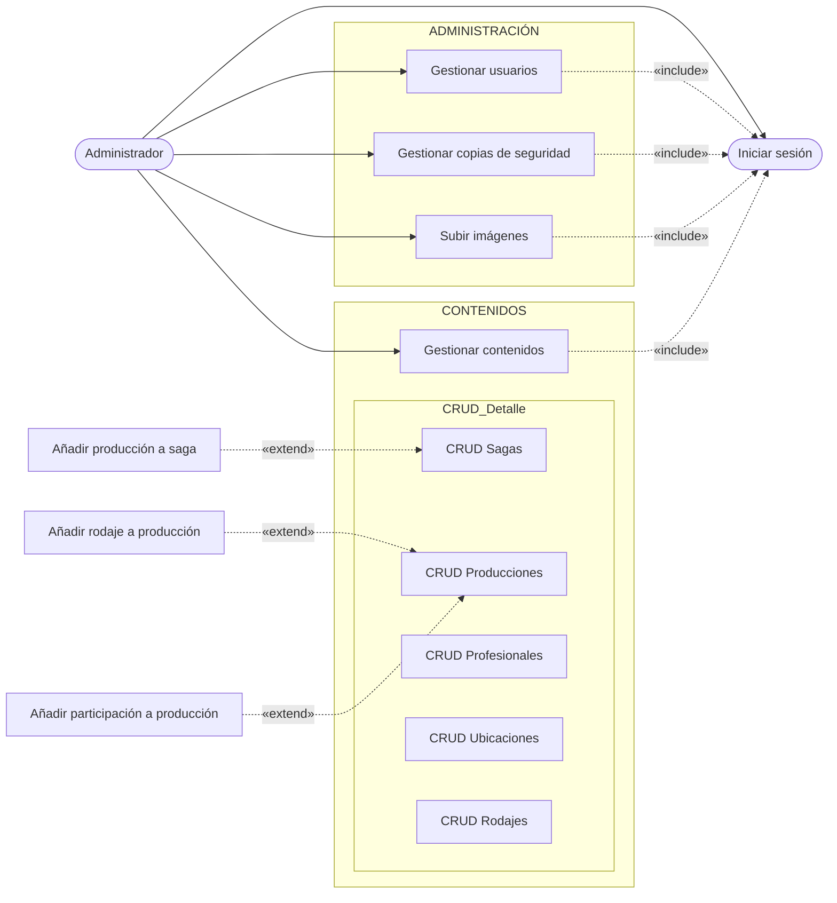
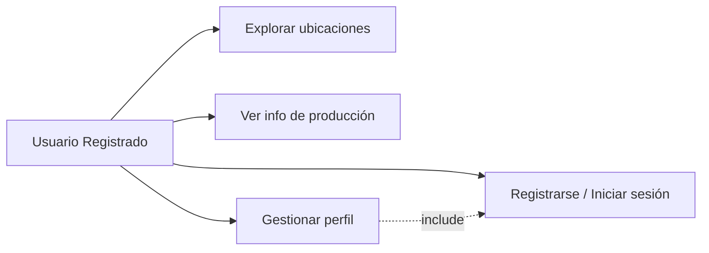
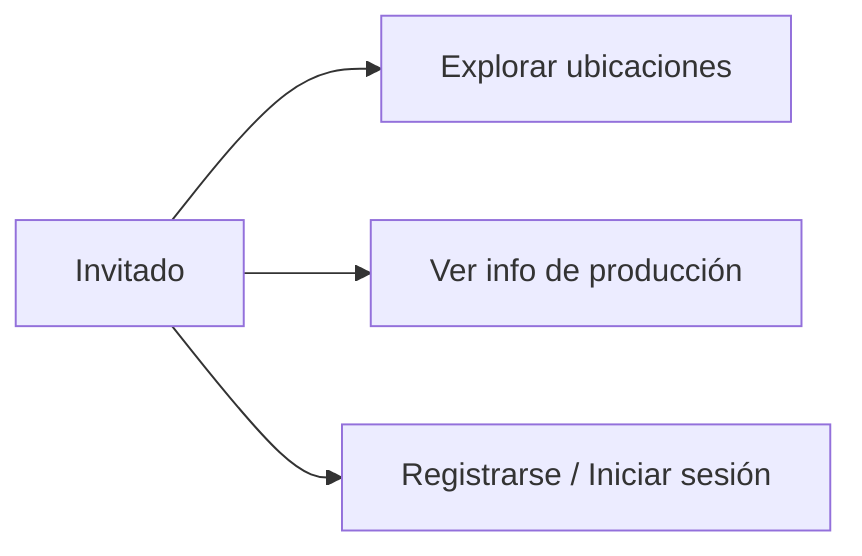
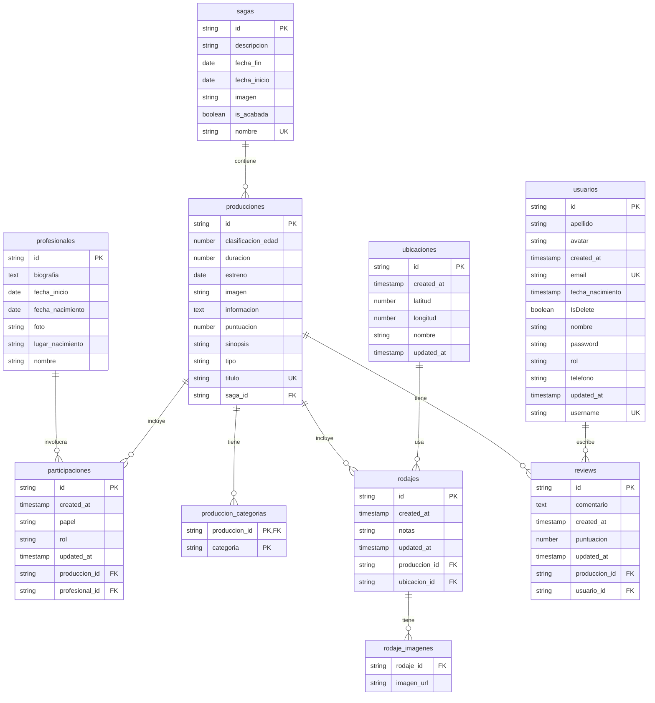
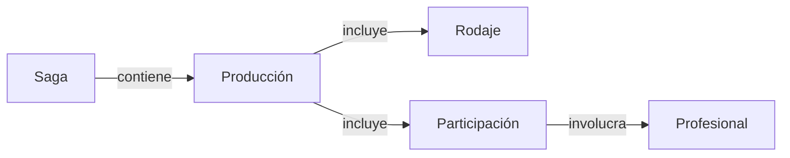

# 📚 Documentación

## Índice

- Introducción
- Requisitos
    - Requisitos No Funcionales
    - Requisitos Funcionales
    - Requisitos de Información
- Diagramas de Casos de Uso
    - Administradores
    - Usuarios Registrados
    - Usuarios Invitados
- Diagrama de Clases
- Endpoints REST
- Estructura de Carpetas
    - Backend
    - Frontend
- Tecnologías Empleadas
- Costes
    - Costes Iniciales
    - Costes Mensuales de Infraestructura
    - Costes Mensuales de Operación
    - Resumen Global
    - Desglose RR. HH.
- Bibliografía y Recursos
    - Documentación Oficial
    - Recursos Front-End e Inspiración

---

## Introducción

**MovieTrip** es una aplicación web diseñada específicamente para los amantes del cine y los viajes, que desean explorar y descubrir los lugares reales donde fueron rodadas sus películas, series y cortometrajes favoritos. El proyecto busca combinar la pasión por el cine con la experiencia del turismo, ofreciendo a los usuarios herramientas interactivas para planificar rutas cinematográficas únicas.

La aplicación proporciona mapas interactivos que muestran ubicaciones exactas de rodaje, además de información completa y detallada sobre producciones cinematográficas, actores, directores y datos curiosos sobre cada rodaje. La interfaz amigable y accesible permite a los usuarios explorar estas locaciones fácilmente desde cualquier dispositivo.

Desde un punto de vista técnico, **Movie Trip** está construido con un backend desarrollado en Kotlin usando el framework Spring Boot, empleando PostgreSQL para la persistencia de datos y Redis para la gestión de caché. El frontend está desarrollado en Vue.js con **Bootstrap** para asegurar una interfaz atractiva, intuitiva y responsiva. La aplicación se despliega utilizando contenedores Docker en AWS (EC2), facilitando la escalabilidad y mantenibilidad.

Entre las funcionalidades disponibles destacan la gestión completa de contenidos como producciones, sagas cinematográficas, profesionales involucrados y ubicaciones detalladas, además de la administración segura de usuarios mediante JWT y OAuth2. Las imágenes relacionadas con los contenidos son gestionadas eficientemente mediante Firebase Storage, proporcionando velocidad y confiabilidad en la entrega de estos recursos. El proyecto también incluye funcionalidades esenciales de administración como la realización, importación y exportación de copias de seguridad.

Con **Movie Trip**, los usuarios podrán descubrir y experimentar el cine de una manera totalmente nueva, acercando la magia de la pantalla a sus viajes y aventuras personales.

---

## Requisitos

### Requisitos No Funcionales

RNF 1 - Todas las peticiones se recibirán y enviarán en formato JSON.

RNF 2 - Un usuario con rol "USUARIO" no podrá acceder a las funciones de administrador.

RNF 3 - Un usuario con rol "ADMINISTRADOR" tendrá acceso a todas las funcionalidades del sistema.

RNF 4 - Los datos relacionales del sistema se almacenarán en PostgreSQL.

RNF 5 - El sistema seguirá una arquitectura orientada al dominio (DDD).

RNF 6 - Se implementará autenticación y autorización usando JWT y OAuth2.

RNF 7 - Las contraseñas e información sensible se almacenarán cifradas con BCrypt.

RNF 8 - Se utilizará Git con GitHub y metodología GitFlow para gestionar el código fuente del proyecto.

RNF 9 - Se implementará un sistema completo de logs para auditoría y depuración.

RNF 10 - El frontend será responsive, accesible desde dispositivos móviles y escritorios.

RNF 11 - La aplicación se desplegará usando Docker en infraestructura AWS EC2.

RNF 12 - Las imágenes se gestionarán mediante Firebase Storage.

RNF 13 - El sistema deberá soportar al menos 500 usuarios concurrentes sin degradar su rendimiento.

RNF 14 - Disponibilidad mínima del sistema del 99.5% mensual.

RNF 15 - Se realizarán tests con JUnit y MockMvc, manteniendo una cobertura mínima del 85%.

RNF 16 - Se utilizarán pruebas EndToEnd con Cypress y Postman.

RNF 17 - Se documentará la API mediante Swagger/OpenAPI.

---

### Requisitos Funcionales

RF 1 - Gestión de Usuarios.

- RF 1.1 - Registro de usuario.
- RF 1.2 - Inicio de sesión.
- RF 1.3 - Actualizar perfil de usuario.
- RF 1.4 - Eliminar usuario.
- RF 1.5 - Administración de usuarios (CRUD por administrador).

RF 2 - Gestión de Producciones.

- RF 2.1 - Crear producción.
- RF 2.2 - Buscar producción.
- RF 2.3 - Actualizar producción.
- RF 2.4 - Eliminar producción.

RF 3 - Gestión de Sagas.

- RF 3.1 - Crear saga.
- RF 3.2 - Buscar saga.
- RF 3.3 - Actualizar saga.
- RF 3.4 - Eliminar saga.

RF 4 - Gestión de Profesionales.

- RF 4.1 - Crear profesional.
- RF 4.2 - Buscar profesional.
- RF 4.3 - Actualizar profesional.
- RF 4.4 - Eliminar profesional.

RF 5 - Gestión de Ubicaciones.

- RF 5.1 - Crear ubicación.
- RF 5.2 - Buscar ubicación.
- RF 5.3 - Actualizar ubicación.
- RF 5.4 - Eliminar ubicación.

RF 6 - Gestión de Rodajes.

- RF 6.1 - Crear rodaje.
- RF 6.2 - Buscar rodaje.
- RF 6.3 - Actualizar rodaje.
- RF 6.4 - Eliminar rodaje.

RF 7 - Gestión de Imágenes.

- RF 7.1 - Subir imágenes asociadas a producciones, profesionales y ubicaciones mediante Firebase Storage.

RF 8 - Gestión de Copias de Seguridad.

- RF 8.1 - Realizar copias de seguridad completas.
- RF 8.2 - Exportar copia de seguridad.
- RF 8.3 - Importar copia de seguridad.

---

### Requisitos de Información

### Usuarios

- id (UUID, PK)
- nombre (string)
- apellido (string)
- username (string, único)
- email (string, único)
- teléfono (string, válido)
- password (string, cifrado con BCrypt, 8-20 caracteres)
- fecha_nacimiento (date)
- rol (enum: USUARIO, ADMINISTRADOR)
- avatar (string, URL Firebase)
- created_at (timestamp)
- updated_at (timestamp)

### Producciones

- id (UUID, PK)
- título (string, único)
- tipo (enum: PELICULA, SERIE, CORTO)
- estreno (date)
- duración (int, minutos)
- sinopsis (string)
- imagen (string, URL Firebase)
- clasificación_edad (int, 0-4)
- saga_id (UUID, FK)
- puntuación (double, 0-10)
- información adicional (text)
- categorías (enum: ficción, aventura, terror, comedia, drama, documental, animación, romance, crimen, acción, ciencia ficción, fantasía, musical, western, suspense)

### Sagas

- id (UUID, PK)
- nombre (string, único)
- descripción (text)
- is_acabada (boolean)
- fecha_inicio (date)
- fecha_fin (date)
- imagen (string, URL Firebase)

### Profesionales

- id (UUID, PK)
- nombre (string)
- biografía (text)
- fecha_inicio (date)
- fecha_nacimiento (date)
- lugar_nacimiento (string)
- foto (string, URL Firebase)

### Participaciones

- id (GUID, PK)
- Rol
- Papel
- Profesional
- Producción

### Ubicaciones

- id (GUID, PK)
- nombre (string)
- latitud (double)
- longitud (double)
- imágenes (string[], URLs Firebase)
- created_at (timestamp)
- updated_at (timestamp)

### Rodajes

- id (UUID, PK)
- notas (string)
- produccion_id (UUID, FK)
- ubicacion_id (UUID, FK)
- imágenes (string[], URLs Firebase)
- created_at (timestamp)
- updated_at (timestamp)

---

## Diagramas de Casos de Uso

A continuación se muestran los diagramas de casos de uso principales con sintaxis Mermaid válida.

### 1. Casos de Uso para **Administradores**



---

### 2. Casos de Uso para **Usuarios Registrados**



---

### 3. Casos de Uso para **Usuarios Invitados**



---

## Diagrama de Clases





---

## Endpoints REST

> Leyenda de colores
> 
> 
> 🔵 **GET**   🟢 **POST**   🟡 **PUT**   🔴 **DELETE**
> 

---

### 1. Autenticación

- 🟢 **POST** `/api/v1/auth/registro` – Registrar usuario.
- 🟢 **POST** `/api/v1/auth/signin` – Iniciar sesión (JWT).

---

### 2. Profesionales

- 🔵 `/api/profesionales/{id}` – Obtener profesional por ID.
- 🟡 `/api/profesionales/{id}` – Actualizar profesional.
- 🔴 `/api/profesionales/{id}` – Eliminar profesional.
- 🔵 `/api/profesionales` – Listar profesionales (paginado).
- 🟢 `/api/profesionales` – Crear profesional.
- 🟢 `/api/profesionales/{id}/subir-imagen` – Subir avatar/foto.
- 🔵 `/api/profesionales/filtrar` – Filtrar con varios criterios.
- 🔵 `/api/profesionales/buscar` – Buscar por nombre.

---

### 3. Participaciones

- 🔵 `/api/participaciones/{id}` – Obtener participación.
- 🟡 `/api/participaciones/{id}` – Actualizar participación.
- 🔴 `/api/participaciones/{id}` – Eliminar participación.
- 🔵 `/api/participaciones` – Listar participaciones (paginado).
- 🟢 `/api/participaciones` – Crear participación.
- 🔵 `/api/participaciones/profesional/{profesionalId}` – Participaciones de un profesional.
- 🔵 `/api/participaciones/produccion/{produccionId}` – Participaciones de una producción.

---

### 4. Sagas

- 🔵 `/api/sagas/{id}` – Obtener saga.
- 🟡 `/api/sagas/{id}` – Actualizar saga.
- 🔴 `/api/sagas/{id}` – Eliminar saga.
- 🔵 `/api/sagas` – Listar sagas.
- 🟢 `/api/sagas` – Crear saga.
- 🟢 `/api/sagas/{sagaId}/producciones/{produccionId}` – Añadir producción a saga.
- 🔴 `/api/sagas/{sagaId}/producciones/{produccionId}` – Quitar producción de saga.
- 🟢 `/api/sagas/{id}/subir-imagen` – Subir imagen saga.
- 🔵 `/api/sagas/paginado` – Listar paginadas.
- 🔵 `/api/sagas/filtro` – Filtrar sagas.
- 🔵 `/api/sagas/existe/{id}` – Comprobar por ID.
- 🔵 `/api/sagas/existe/nombre/{nombre}` – Comprobar por nombre.

---

### 5. Ubicaciones

- 🔵 `/api/ubicaciones/{id}` – Obtener ubicación.
- 🟡 `/api/ubicaciones/{id}` – Actualizar ubicación.
- 🔴 `/api/ubicaciones/{id}` – Eliminar ubicación.
- 🔵 `/api/ubicaciones` – Listar ubicaciones (paginado).
- 🟢 `/api/ubicaciones` – Crear ubicación.
- 🟢 `/api/ubicaciones/filtro` – Filtrar ubicaciones.
- 🔵 `/api/ubicaciones/all` – Listar todas (sin paginar).

---

### 6. Producciones

- 🔵 `/api/producciones/{id}` – Obtener producción.
- 🟡 `/api/producciones/{id}` – Actualizar producción.
- 🔴 `/api/producciones/{id}` – Eliminar producción.
- 🔵 `/api/producciones` – Listar producciones (paginado).
- 🟢 `/api/producciones` – Crear producción.
- 🟢 `/api/producciones/{id}/subir-imagen` – Subir póster.
- 🔵 `/api/producciones/tipos` – Tipos disponibles.
- 🔵 `/api/producciones/filtrar` – Filtrar producciones.
- 🔵 `/api/producciones/completa/{id}` – Producción completa (con saga, participaciones, rodajes).
- 🔵 `/api/producciones/clasificaciones-edad` – Clasificaciones edad.
- 🔵 `/api/producciones/categorias` – Categorías.
- 🔵 `/api/producciones/all` – Todas las producciones (sin paginar).

---

### 7. Usuarios

- 🔵 `/api/usuarios/{id}` – Obtener usuario.
- 🟡 `/api/usuarios/{id}` – Actualizar usuario.
- 🔴 `/api/usuarios/{id}` – Eliminar usuario (hard).
- 🔵 `/api/usuarios` – Listar usuarios.
- 🟢 `/api/usuarios` – Crear usuario (admin).
- 🟢 `/api/usuarios/{id}/upload-avatar` – Subir avatar.
- 🟢 `/api/usuarios/restaurar/{id}` – Restaurar usuario eliminado lógicamente.
- 🟢 `/api/usuarios/admin` – Crear administrador.
- 🔵 `/api/usuarios/yo` – Perfil propio.
- 🔵 `/api/usuarios/filtro` – Filtrar usuarios.
- 🔵 `/api/usuarios/comprobar-nombre-de-usuario` – Comprobar disponibilidad username.
- 🔵 `/api/usuarios/verificar-correo` – Verificar email.
- 🔴 `/api/usuarios/soft/{id}` – Eliminación lógica.

---

### 8. Rodajes

- 🔵 `/api/rodajes/{id}` – Obtener rodaje.
- 🟡 `/api/rodajes/{id}` – Actualizar rodaje.
- 🔴 `/api/rodajes/{id}` – Eliminar rodaje.
- 🟢 `/api/rodajes` – Crear rodaje.
- 🔵 `/api/rodajes/produccion/{produccionId}` – Rodajes de una producción.

---

### 9. Backups

- 🟢 `/api/backups/import` – Importar backup.
- 🔵 `/api/backups` – Listar backups disponibles.
- 🔵 `/api/backups/export` – Generar backup.
- 🔵 `/api/backups/download/{fileName}` – Descargar backup.

---

## Estructura de carpetas

### Backend

```
org.wolve.geofilm
├── auth
│   ├── controller
│   ├── dto
│   └── services
├── config
│   ├── auth
│   └── storage
├── producciones
│   ├── participacion
│   │   ├── controller
│   │   ├── dto
│   │   ├── exceptions
│   │   ├── mappers
│   │   ├── models
│   │   ├── repository
│   │   └── services
│   ├── produccion
│   ├── profesional
│   ├── rodajes
│   ├── saga
│   └── ubicaciones
├── users
├── utils
│   ├── email
│   ├── generators
│   ├── pagination
│   └── storage
├── GeoFilmApplication.kt
└── resources
    ├── db.migration
    ├── templates
    └── application.properties

```

¿Por qué esta estructura? Beneficios de esta organización

1. **Alta cohesión, bajo acoplamiento**. Cada dominio controla su propio MVC (Model‑Mapper/Repo‑Service‑Controller).
2. **Escalabilidad**. Añadir una nueva feature (p.e. *reviews*) implica crear un paquete bajo `producciones` sin tocar paquetes core.
3. **Legibilidad**. Cualquier desarrollador puede navegar directamente al área que necesita mantener.
4. **Pruebas aisladas**. Los tests unitarios se alinean con los mismos paquetes, simplificando la cobertura.
5. **Compatibilidad con Spring**. Mantiene convenciones de escaneo de componentes y evita conflictos de beans.

---

### Frontend

```
src
├── assets
├── components
│   ├── cards
│   ├── modales
│   └── principal
├── layouts
├── pages
│   ├── admin
│   ├── auth
│   ├── general
│   └── user
│       ├── About.vue
│       ├── Home.vue
│       └── NotFound.vue
├── router
├── services
│   ├── api.js
│   ├── auth.service.js
│   ├── interceptors.js
│   ├── participaciones.service.js
│   ├── producciones.service.js
│   ├── profesional.service.js
│   ├── rodajes.service.js
│   ├── sagas.service.js
│   ├── ubicaciones.service.js
│   └── users.service.js
├── stores
├── utils
├── App.vue
├── axios.js
├── main.js
├── style.css
└── .env

```

### Beneficios

1. **Modularidad**: cada carpeta agrupa archivos relacionados, facilitando mantenibilidad.
2. **Carga perezosa**: las sub‑carpetas de `pages` permiten lazy‑loading automático con Vue Router.
3. **Escalabilidad**: añadir una nueva sección (p.e. *reviews*) solo requiere un sub‑paquete en `pages` y un nuevo servicio.
4. **Responsabilidad única**: componentes UI no manejan lógica de red ni estado global; cada capa tiene su cometido.
5. **Facilidad de pruebas**: servicios desacoplados permiten mocks en tests de componentes.

---

## Tecnologías empleadas en **MovieTrip**

A continuación se describen las principales herramientas, librerías y servicios utilizados durante el desarrollo y despliegue de la aplicación.

---

### Kotlin

Kotlin es el lenguaje elegido para el backend por su sintaxis concisa, seguridad frente a nulos y plena interoperabilidad con el ecosistema Java. Facilita la escritura de código limpio y expresivo.

### Spring Boot

Framework que estructura la capa de servicios REST, gestiona la inyección de dependencias y simplifica la configuración. Proporciona arranque rápido y convenciones estables para construir micro‑servicios.

### Spring Security + JWT

Implementa la autenticación y autorización. Generamos JSON Web Tokens tras el inicio de sesión y los validamos en cada petición, diferenciando claramente los roles **USUARIO** y **ADMINISTRADOR**.

### BCrypt

Algoritmo de hashing utilizado para cifrar las contraseñas antes de almacenarlas en la base de datos, garantizando que nunca se guarden en texto plano.

### PostgreSQL

Base de datos relacional que persiste todas las entidades de dominio (producciones, profesionales, usuarios, sagas, etc.). Destaca por su robustez y soporte para tipos avanzados.

### Docker & Docker Compose

Herramientas de contenedorización que aseguran la misma configuración en desarrollo y producción. Con Compose se orquestan backend, frontend y base de datos en un único comando.

### Amazon Web Services (EC2, RDS, S3)

- **EC2** aloja los contenedores de la aplicación.
- **RDS** ofrece PostgreSQL gestionado, liberándonos de tareas de mantenimiento.

### Firebase Storage

Servicio de almacenamiento de objetos usado para guardar las imágenes de usuario, producciones, profesionales y ubicaciones, beneficiándose de la red CDN global de Google.

### Google Maps Platform

Proporciona los mapas interactivos y la geocodificación de coordenadas necesarias para mostrar las ubicaciones de rodaje sobre el mapa.

### Vue.js

Framework JavaScript adoptado para el frontend SPA. Su sistema reactivo facilita la construcción de interfaces dinámicas y la gestión eficiente del estado.

### Bootstrap / Bootstrap‑Vue

Conjunto de utilidades CSS y componentes que permiten crear rápidamente un diseño responsive manteniendo la coherencia visual entre pantallas.

### Vite + npm

Vite actúa como servidor de desarrollo y herramienta de construcción ultrarrápida para Vue. npm gestiona las dependencias y scripts del proyecto frontend.

### Swagger / OpenAPI

Genera documentación interactiva de la API, facilitando la prueba de endpoints y el onboarding de otros desarrolladores.

### Gradle (Kotlin DSL)

Sistema de construcción del backend. Controla dependencias, tareas de compilación y procesos de integración continua.

### JUnit 5 + MockkMvc

Conjunto de herramientas para pruebas unitarias y de integración del backend, asegurando la calidad del código.

### Cypress

Framework de pruebas end‑to‑end que simula la interacción de un usuario real en el navegador, garantizando el correcto funcionamiento del frontend.

### Toastify JS

Biblioteca ligera que muestra notificaciones emergentes (toasts) para informar al usuario de operaciones completadas o errores.

### AOS, Atropos y Floating UI

Pequeñas librerías para animaciones de scroll, efectos parallax y posicionamiento de tooltips/popovers, aportando dinamismo y mejor usabilidad a la UI.

### Git + GitHub

Sistema de control de versiones distribuido y alojamiento de repositorio remoto. Se sigue un flujo GitFlow para organizar el trabajo y las revisiones.

### IntelliJ IDEA Ultimate

IDE principal para el desarrollo backend en Kotlin y Spring Boot. Ofrece autocompletado avanzado, depuración y asistentes específicos para Spring.

---

## Costes

### Costes iniciales de la aplicación

| Concepto | Horas / Unidades | Coste unitario (€) | Subtotal (€) |
| --- | --- | --- | --- |
| **Tareas RR. HH.** (diseño, desarrollo, pruebas) | 480 h | **45,00** | **21 600,00** |
| Análisis y diseño | – | – | 1 800,00 |
| Documentación técnica + usuario | – | – | 1 100,00 |
| Despliegue en AWS (infra + CI/CD) | – | – | 900,00 |
| Despliegue de informes de tests | – | – | 500,00 |
| Manuales y tutoriales en vídeo | – | – | 450,00 |
| **Subtotal** |  |  | **26 350,00** |
| Margen imprevistos (10 %) |  |  | 2 635,00 |
| Margen beneficio (15 %) |  |  | 4 343,00 |
| **Total costes iniciales** |  |  | **33 328,00 €** |

> Coste hora analista-desarrollador: 45 €/h (salario + costes de empresa).
> 

---

### Costes mensuales de infraestructura

| Concepto | Precio/mes (€) | Notas |
| --- | --- | --- |
| AWS EC2 (t2.small) + EBS + balanceador | 115,00 | Free Tier superado; 1 × instancia + disco 50 GB |
| AWS RDS PostgreSQL (db.t3.micro) | 22,00 | 20 GB |
| AWS S3 + transferencias | 10,00 | logs y artefactos |
| Firebase Storage | 25,00 | 50 GB salida CDN |
| Google Maps API | 7,00 | 60 000 llamadas/mes (tras crédito gratuito) |
| JetBrains IDEA Ultimate (1 lic.) | 14,00 | prorrateo de 169 $/año |
| GitHub Pro (1 usuario) | 9,00 | 9 $/mes |
| Dominio + SSL | 7,00 | Route 53/Cert Manager |
| **Subtotal mensual** | **209,00 €** |  |
| Margen imprevistos (10 %) | 20,90 |  |
| Margen beneficio (15 %) | 34,50 |  |
| **Total infraestructura mensual** | **264,40 €** |  |

---

### Costes mensuales propios de la aplicación

| Concepto | Precio/mes (€) | Notas |
| --- | --- | --- |
| Mantenimiento correctivo/evolutivo (8 h) | **360,00** | 45 €/h |
| Atención a usuarios / soporte (4 h) | 180,00 | 45 €/h |
| Monitorización y backups automatizados | 35,00 | AWS Backup + CloudWatch |
| Seguridad (WAF + escaneos) | 40,00 | AWS WAF + trivy |
| **Subtotal mensual** | **615,00 €** |  |
| Margen imprevistos (10 %) | 61,50 |  |
| Margen beneficio (15 %) | 101,50 |  |
| **Total aplicación mensual** | **778,00 €** |  |

---

### Resumen global

| Concepto | Importe (€) |
| --- | --- |
| **Costes iniciales** | **33 328,00** |
| Costes mensuales infraestructura | 264,40 |
| Costes mensuales aplicación | 778,00 |
| **Costes mensuales totales** | **1 042,40 €** |

---

### Desglose RR. HH. por requisito funcional

| RF | Descripción resumida | Horas |
| --- | --- | --- |
| RF1 | Gestión de usuarios (CRUD + auth) | 50 |
| RF2 | Gestión de producciones | 65 |
| RF3 | Gestión de sagas | 24 |
| RF4 | Gestión de profesionales | 36 |
| RF5 | Gestión de ubicaciones | 38 |
| RF6 | Gestión de rodajes | 32 |
| RF7 | Subida de imágenes (Firebase) | 20 |
| RF8 | Copias de seguridad (export/import) | 25 |
| **Total** |  | **290 h** |

---

## Bibliografía y Recursos

### Documentación oficial

- [Kotlin](https://kotlinlang.org/)
- [Spring Framework / Spring Boot](https://spring.io/)
- [Vue.js](https://vuejs.org/)
- [Bootstrap / Bootstrap‑Vue](https://getbootstrap.com/)
- [Docker](https://www.docker.com/)
- [PostgreSQL](https://www.postgresql.org/)
- [Firebase Storage](https://firebase.google.com/)
- Google Maps Platform
- [Amazon Web Services (AWS)](https://aws.amazon.com/)
- [Swagger / OpenAPI](https://swagger.io/)
- [JWT (JSON Web Tokens)](https://jwt.io/)
- [BCrypt (Spring Security)](https://docs.spring.io/spring-security/reference/servlet/authentication/passwords/bcrypt.html)

---

### Recursos FrontEnd e inspiración

### Fuentes

- [Free Faces Gallery](https://www.freefaces.gallery/)

### Componentes y UI kits

- [Uiverse.io](https://uiverse.io/)
- [Magic UI](https://magicui.design/)
- [PrimeVue](https://primevue.org/)
- [PrimeNG](https://primeng.org/)

### Estilos y animaciones

- [Neumorphism Generator](https://neumorphism.io/#e0e0e0)
- [AOS (Animate On Scroll)](https://michalsnik.github.io/aos/)
- [Atropos JS](https://atroposjs.com/docs)
- [Floating UI](https://floating-ui.com/docs/getting-started)

### Otros recursos

- [Dark Design – modo oscuro y plantillas](https://www.dark.design/)
- Inspiración UI: [Mobbin](https://mobbin.com/) · [Dribbble](https://dribbble.com/)
- [Colormind – paletas de colores](http://colormind.io/)
- Iconos: [pqoqubbw/icons](https://github.com/pqoqubbw/icons) · [Lordicon](https://lordicon.com/) · [Flaticon](https://www.flaticon.es/) · [FontAwsome](https://fontawesome.com/)
- [Swiper JS](https://swiperjs.com/)
- Notificaciones: [Toastify JS](https://apvarun.github.io/toastify-js/#)